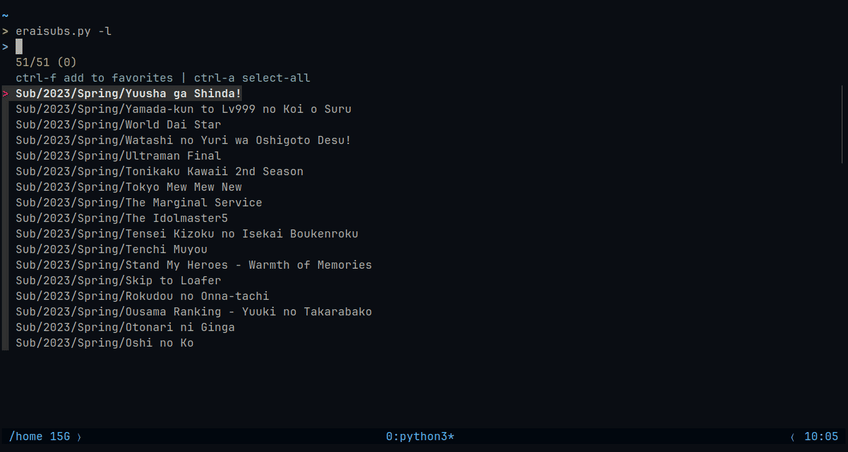

## Setup
Debian
```
sudo apt install fzf python3-pip
```

Arch Linux
```
sudo pacman -Syu fzf python-pip
```

> Recommended: [Creating a virtual environment](https://packaging.python.org/en/latest/guides/installing-using-pip-and-virtual-environments/#creating-a-virtual-environment)
```
pip install -r requirements.txt
```

---


```
Usage: eraisubs.py [options]

Options:
  -h, --help  show this help message and exit
  -d PATH     Path to save downloaded files
  -f          List favorites
  -r          Remove entry from favorites
  -l          List the latest releases
  -y YEAR     Start from year
  -C FILE     Path to cookie file
  -c COOKIE   Cookie string
```


